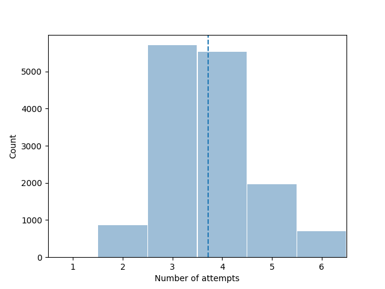
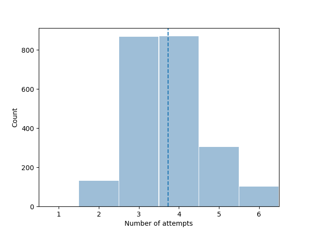

# wordle-bot

An entropy based Wordle guessing bot

## Installation

1. Clone the repo to a local directory

```commandline
git clone https://github.com/akkshay0107/wordle-bot.git
```

2. Install the necessary Python packages

```commandline
python -m pip install numpy
```

3. Run the script to start a round of Wordle

```commandline
python wordle_bot.py
```

## Example

Example of the bot being used to solve Wordle #625

```
python wordle_bot.py

Welcome to Wordle Bot!
When the computer asks for a result, input it as 5 separate numbers with a space in between each
0 = grey square
1 = yellow square
2 = green square
eg: ⬛⬛🟩🟨🟨 ("BBGYY") should be inputted as 0 0 2 1 1 in the program

Start a new game ? (Y/n)
Y
Enter guess : raise
Enter result : 0 0 1 0 0
Suggested word : pilot
Enter guess : pilot
Enter result : 2 2 0 0 0
Suggested word : pinch
Enter guess : pinch
Enter result : 2 2 2 0 0
Suggested word : pinky
Enter guess : pinky
Enter result : 2 2 2 2 2
Your guess is the correct answer
```

## Statistics

1. When the bot was run on a randomly selected answer 15000 times

```
Mean Score = 3.7225006773232185
Standard Deviation = 0.9327163115837637
Failure rate = 1.5733333333333377%
```



2. When the bot was run on each possible answer exactly once

```
Mean Score = 3.725032996040475
Standard Deviation = 0.9236458733233283
Failure rate = 1.5591165006496266%
```



### Bots Preferred Starting Word

On the new list of allowed words, the bot has determined "raise" to be the word giving the most information in exactly
one turn.